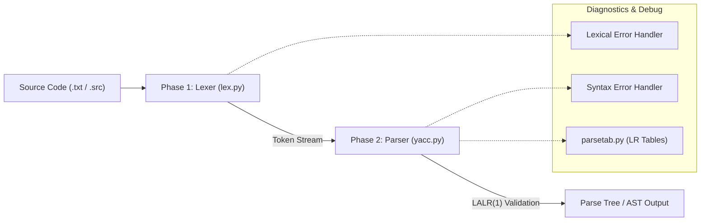

<div align="center">

# ⚙️ Compiler Design with Python PLY

<p align="center">
  <b>A Multi-Phase Language Processing Pipeline Implemented Using Python Lex-Yacc (PLY)</b>
</p>

</div>

---

## Overview

This repository hosts a compiler front-end built in Python using **PLY (Python Lex-Yacc)**, an implementation of traditional `lex` and `yacc` parsing tools for Python. 

The project demonstrates core theoretical and practical compiler construction concepts, divided into distinct execution phases:
- **Phase 1 (Lexer):** Tokenization, regular expression matching, and source stream lexical analysis.
- **Phase 2 (Parser):** Context-Free Grammar (CFG) specification, shift-reduce syntax validation via LALR(1) tables, and Abstract Syntax Tree (AST) preparation.

---

## Phase 1: Lexical Analysis

The **Lexical Analyzer (Scanner)** processes the raw input string and groups sequences of characters into meaningful syntactic units called **Tokens**.

### Responsibilities:
- **Token Identification:** Identifiers, reserved keywords (`if`, `else`, `while`, `return`, etc.), numeric literals (integers, floats), and operators.
- **Whitespace & Comment Stripping:** Cleans line comments and multi-line comment blocks.
- **Line & Column Tracking:** Maintains line numbers (`lexer.lineno`)- **Token Identification:** Identifiers, reserved keywords (`if`, `else`, `while`, `return`, etc.), numeric literals (integers, floats), and operators.
- **Whitespace & Comment Stripping:** Cleans line comments and multi-line comment blocks.
- **Line & Column Tracking:** Maintains line numbers (`lexer.lineno`) for accurate source mapping and syntax debugging.
- **Lexical Error Handling:** Catches illegal characters with custom error callbacks (`t_error`).

---

## Phase 2: Syntax Analysis

The **Syntax Analyzer (Parser)** receives tokens from the Lexer and checks whether the token sequence conforms to the language's Context-Free Grammar (CFG).

### Responsibilities:
- **LALR(1) Parsing:** Generates shift-reduce parse tables with conflict detection (Shift/Reduce or Reduce/Reduce).
- **Operator Precedence & Associativity:** Explicitly handles ambiguity in arithmetic, logical, and relational expressions:

---

## Prerequisites & Setup

Ensure you have **Python 3.8+** installed.

1. **Clone the Repository:**
```bash
   git clone https://github.com/Mahdye-Asadi/Compiler_PLY.git
   cd Compiler_PLY
   ```
2. **Create and Activate a Virtual Environment:**
   ```bash
   # Linux / macOS
   python3 -m venv venv
   source venv/bin/activate

   # Windows
   python -m venv venv
   venv\Scripts\activate
   ```
3. **Install Dependencies:**
   ```bash
   pip install ply
   ```

---

## Running the Compiler

**Run Phase 1 (Lexer)**
   To tokenize an input program and inspect the recognized token stream:
```bash
   cd Phase1
   python lexer.py
   ```
**Run Phase 2 (Parser)**
To parse input files against the language grammar:
   ```bash
  cd Phase2
  python parser.py
 ```

---

## Grammar & Tokens

### Sample Token Types

| Category | Examples | Regular Expression / Rule |
| :--- | :--- | :--- |
| **Keywords** | `if`, `else`, `while`, `int`, `return` | Exact string matching / Keyword dictionary |
| **Identifiers** | `variable_name`, `counter1` | `[a-zA-Z_][a-zA-Z0-9_]*` |
| **Literals** | `42`, `3.1415`, `"string"` | `\d+(\.\d+)?` / `"(\\.|[^"\\])*"` |
| **Operators** | `+`, `-`, `*`, `/`, `==`, `!=` | Direct literals or regex operators |

---

## Project Structure
```text
Compiler_PLY/
├── Phase1/                     # Phase 1: Lexical Analysis
│   ├── lexer.py                # Token definitions, regex rules, state handling
│   ├── tokens.py               # Reserved keywords and token lists
│   └── test_inputs/            # Sample source code inputs for testing tokens
│
├── Phase2/                     # Phase 2: Syntax Analysis (Parser)
│   ├── parser.py               # CFG grammar rules (p_<rule>), precedence declarations
│   ├── parsetab.py             # Generated LALR parser tables (PLY cache)
│   └── parser.out              # Shift/reduce state machine logs and conflict debugs
│
├── requirements.txt            # Project dependencies (ply)
└── README.md                   # Project documentation
```
---

## Architecture Pipeline

